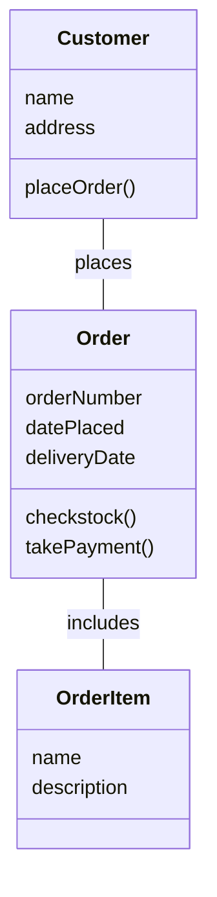

# UML Class Diagram

Here is a UML class diagram, specified using [Mermaid][mer].

```mermaid  
classDiagram
Customer -- Order : places
Order -- OrderItem : includes


class Customer{
name
address
placeOrder()
}

class Order{
orderNumber
datePlaced
deliveryDate
checkstock()
takePayment()
}

class OrderItem{
name
description
}
```

[mer]: https://mermaid.js.org/
